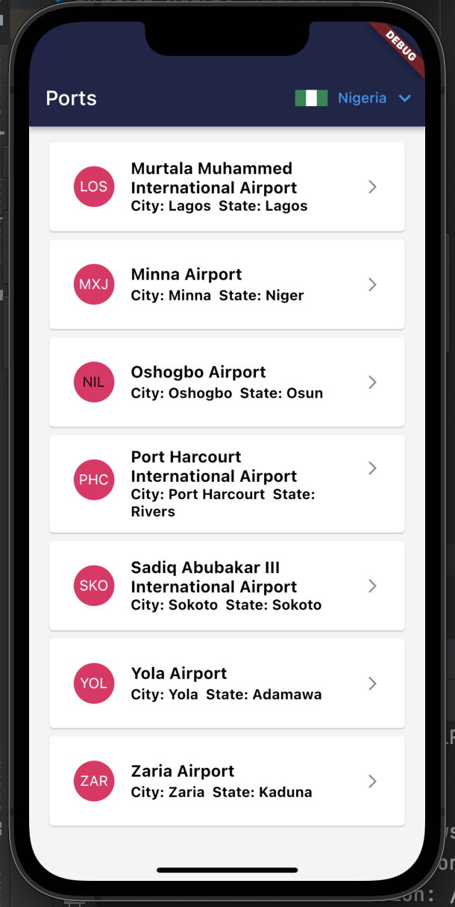
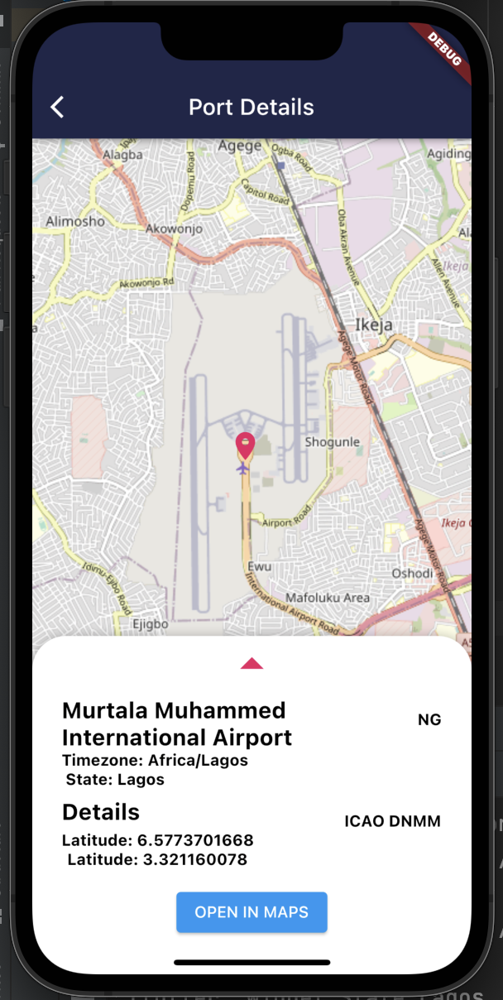

# Airports nearby

A Flutter project.

A database of 28828 entries with basic information about nearly every airport and landing strip in the world. ICAO codes used as primary value. Each entry contains IATA code, airport name, city, two letter ISO country code, elevation above sea level in feet, coordinates in decimal degrees and time zone. (Time zones sourced from [TimeZoneDB](https://timezonedb.com)).

```json
"KOSH": {
    "icao": "KOSH",
    "iata": "OSH",
    "name": "Wittman Regional Airport",
    "city": "Oshkosh",
    "state": "Wisconsin",
    "country": "US",
    "elevation": 808,
    "lat": 43.9844017029,
    "lon": -88.5569992065,
    "tz": "America\/Chicago"
},
```

## Screenshots 
<p float="left">
  
   
  
</p>


## Playstore 
<p float="left">
  <a href="https://play.google.com/store/apps/details?id=com.foluwa.airports_nearby"></a>
</p>
